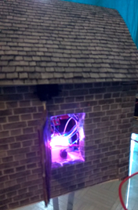
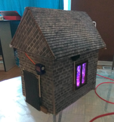
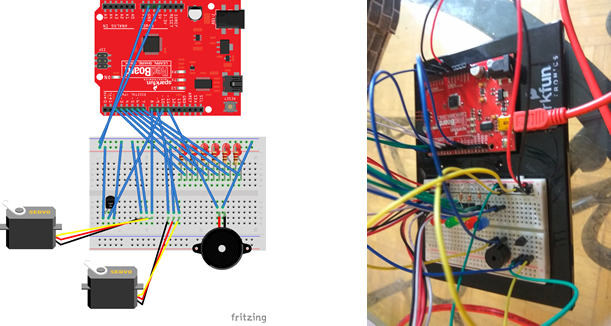
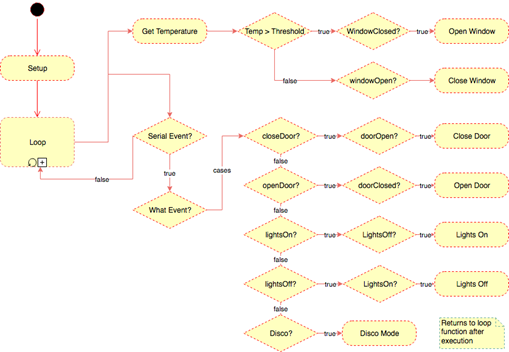

# Voice-Controlled Home Management

## Summary
Toy project to learn more about arduino, home automation and voice control.

## Introduction
At first, I wanted to control my actual house, but for various reasons, this was not feasible. 
Instead, a model home was designed and built to simulate a real house. 
The wall structure was built using drywall for stability.
The doors/windows are made from cardboard and were attached to axles on servo motors. 
Cardboard was chosen for its lightweight properties which do not put stress on the motors.
Inside the house, we have a beadboard with LEDs, a temperature sensor, buzzer, and the necessary jumper cables and resistors.

## Video

Below is a video demonstration of system functions. A voice command is issued and the resulting action happens. 
You may notice the window opening after issuing “lights on” command and then closing on its own. 
This is not because of the command, but because of automation. 
The window behaviour (open/closing) is based on current temperature.

Click image to watch video 

### Timeline of events:
- 00:01 - Open Door
- 00:10 - Lights On
- 00:13 - Window Open (Automatically)
- 00:15 - Window Closed (Automatically)
- 00:17 - Lights Off
- 00:23 - Close Door
- 00:29 - Disco

## Photos
### Model House:

### Arduino Circuit:

### Control Flow:

